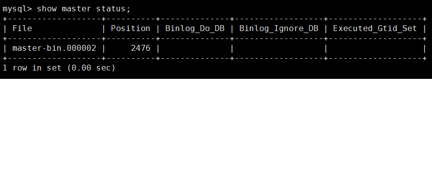

学习笔记  

1、环境搭建  
Linux CentOS 7.2、mysql 5.7

Linux主机安装mysql主库 参考链接:https://blog.csdn.net/qq_37598011/article/details/93489404
docker安装mysql从库   
docker run -itd --name mysql3307 -p 3307:3306 -e MYSQL_ROOT_PASSWORD=123456 mysql:5.7

mysql主库配置

    mysql -u root -p
    CREATE USER 'mysql-slave'@'%' IDENTIFIED BY 'Ctcf1805';
    GRANT REPLICATION SLAVE ON *.* TO 'mysql-slave'@'%';
    flush privileges;
   
    vim /etc/my.cnf
     
    [mysqld]
    bind-address=0.0.0.0
    port=3306
    user=mysql
    basedir=/usr/local/mysql/mysql-5.7.32
    datadir=/data/mysql
    log-bin=master-bin
    server-id=100
    socket=/tmp/mysql.sock
    log-error=/data/mysql/mysql.err
    pid-file=/data/mysql/mysql.pid
    #character config
    character_set_server=utf8mb4
    symbolic-links=0
    explicit_defaults_for_timestamp=true
    
    show master status;
    
    

mysql从库配置

    docker exec -it mysql3307 bash
    vim /etc/mysql/mysql.conf.d/mysqld.cnf
    
    [mysqld]
    pid-file	= /var/run/mysqld/mysqld.pid
    socket		= /var/run/mysqld/mysqld.sock
    datadir		= /var/lib/mysql
    log-bin=mysql-bin
    server-id=2
    
    mysql -u mysql-slave -p -P3306
    
    CREATE USER 'mysql-slave'@'%' IDENTIFIED BY 'password';
    GRANT privileges ON *.* TO 'mysql-slave'@'%';
    flush privileges;
    
    CHANGE MASTER TO
        MASTER_HOST=master ip,  
        MASTER_PORT = 3306,
        MASTER_USER='mysql-slave',      
        MASTER_PASSWORD='Ctcf1805',   
        MASTER_LOG_FILE='mysql-bin.000001',
        MASTER_LOG_POS=157;
        
    start slave;
    show slave status;

 

参考链接: 
<https://segmentfault.com/a/1190000022785399>
<https://www.jianshu.com/p/b0cf461451fb>
        

    
    
    
 

    

        

